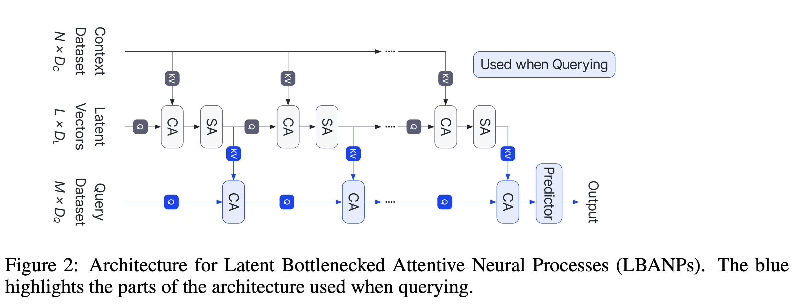

# Latent Bottlenecked Attentive Neural Processes (LBANPs)

This is the official implementation of the paper [Latent Bottlenecked Attentive Neural Processes](https://arxiv.org/abs/2211.08458). 


## Why LBANPs

LBANPs are a new computationally efficient sub-quadratic NP variant, that has a querying computational complexity independent of the number of context datapoints. LBANPs achieve results competitive with the state-of-the-art on meta-regression, image completion, and contextual multi-armed bandits. Furthermore, they can trade-off the computational cost and performance according to the number of latent vectors while also scaling beyond existing attention-based NP variants to larger dataset settings.



## Install

Create and activate a conda environment. Install the dependencies as listed in `requirements.txt`:

```
conda create --name lbanp python=3.7
conda activate lbanp
pip install -r requirements.txt
```

## Usage

Please check the directory of each task for specific usage.

## Reference

For technical details, please check the conference version of our paper.
```
@inproceedings{
    feng2023latent,
    title={Latent Bottlenecked Attentive Neural Processes},
    author={Leo Feng and Hossein Hajimirsadeghi and Yoshua Bengio and Mohamed Osama Ahmed},
    booktitle={International Conference on Learning Representations},
    year={2023},
    url={https://openreview.net/forum?id=yIxtevizEA}
}
```

## Acknowledgement

This code is based on the official code base of [Transformer Neural Processes](https://github.com/tung-nd/TNP-pytorch) (which is based on  the official code base of [Bootstrapping Neural Processes](https://github.com/juho-lee/bnp)). We also use related parts from the Pytorch implementation of [Perceiver](https://github.com/lucidrains/Perceiver-pytorch).


